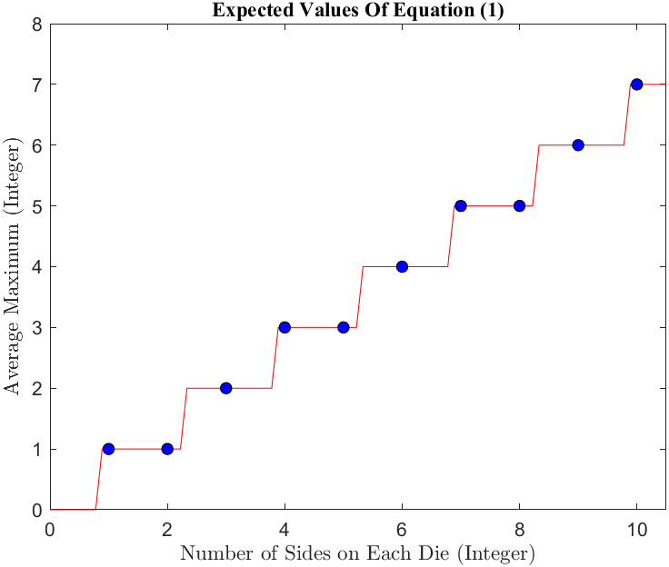

# Expected-Maximum-of-Two-Dice-and-the-Nature-of-Formulas-for-Finite-Sets
- A project I did concerning the expected maximum of two dice and how it relates to a problem to do with the nature of finite sets

  In many games or other simulations, it is a common task to roll two dice, with the same number of sides,
and choose the largest of the two numbers, (or either one if they are equal). In this program, I simulate this for 10,000 iterations for n dice rolls. The PDF paper is a write up on how it relates to a problem concerning the nature of finite sets, especially in computer science, the normality of π, and how there may not always be a "correct" answer to a problem you are given

